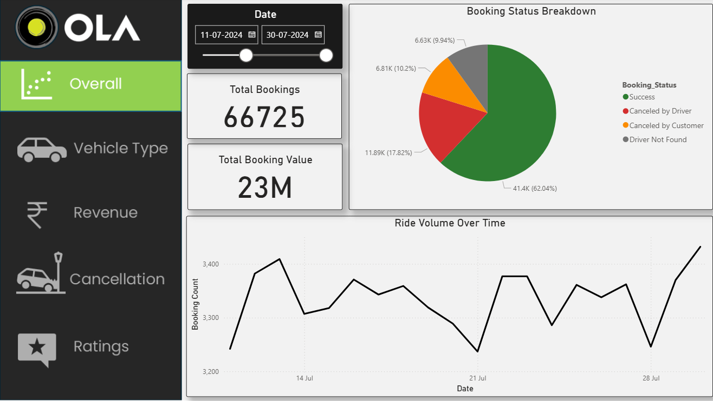
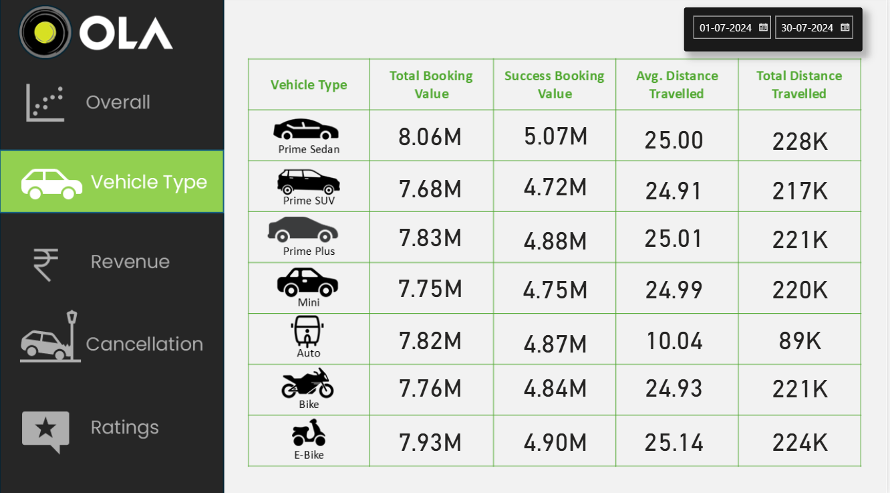
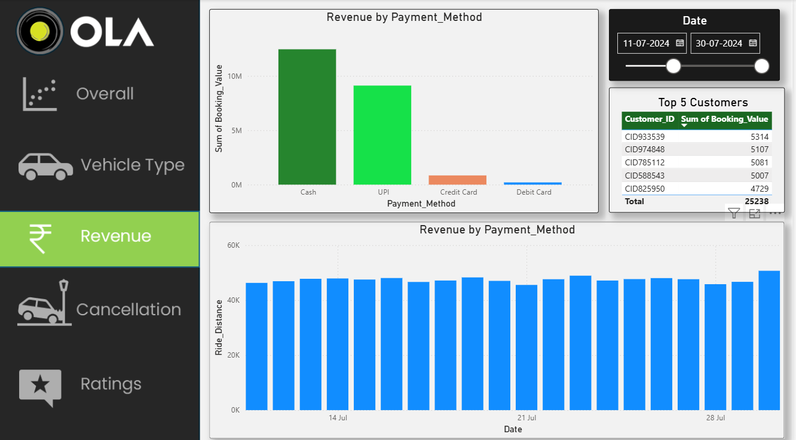
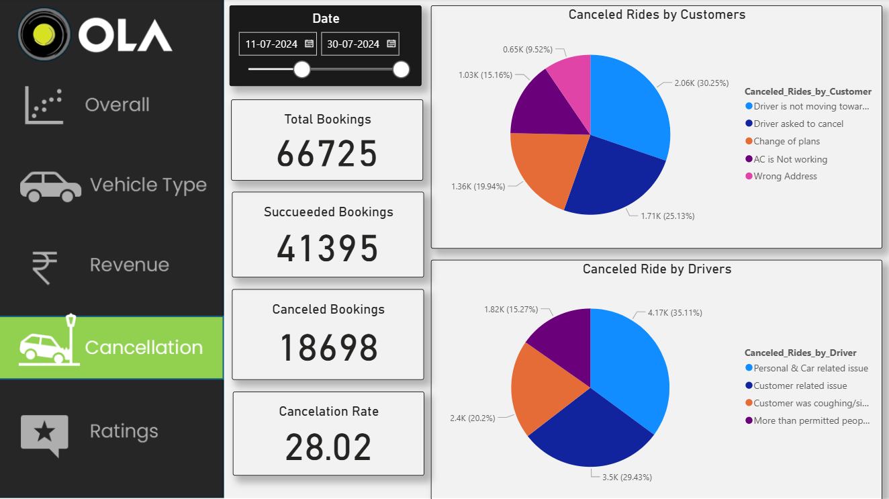
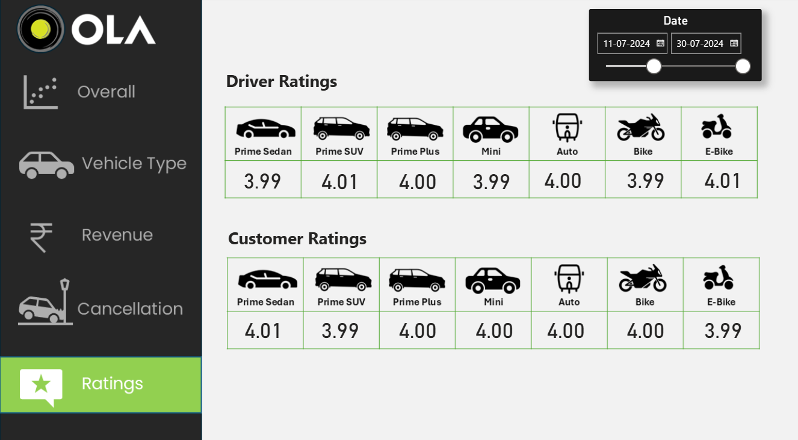

# 🚖 OLA Data Analysis Dashboard

## 📌 Project Overview

The **OLA Data Analysis Dashboard** is an interactive Power BI project designed to analyze ride booking data and generate meaningful business insights. This dashboard provides insights into ride volume, booking status, revenue, vehicle performance, cancellation trends, and customer & driver ratings.

This project demonstrates practical skills in **Power BI**, **Power Query**, **DAX**, and **Data Visualization**.

---

## 🎯 Objectives

- Analyze ride booking trends over time.
- Monitor booking status distribution.
- Compare revenue by payment methods.
- Identify the top customers based on booking value.
- Analyze customer and driver cancellation reasons.
- Evaluate customer and driver ratings.
- Build an interactive business intelligence dashboard.

---

## 📊 Dashboard Features

### 📍 Overall Analysis
- Ride Volume Over Time
- Booking Status Breakdown

### 🚗 Vehicle Type Analysis
- Top 5 Vehicle Types by Ride Distance
- Average Customer Rating by Vehicle Type

### 💰 Revenue Analysis
- Revenue by Payment Method
- Top 5 Customers by Total Booking Value
- Ride Distance Distribution Per Day

### ❌ Cancellation Analysis
- Customer Cancellation Reasons
- Driver Cancellation Reasons

### ⭐ Ratings Analysis
- Driver Rating Distribution
- Customer vs Driver Ratings

---

## 🛠️ Tools & Technologies

- Microsoft Power BI Desktop
- Power Query
- DAX (Data Analysis Expressions)
- Microsoft Excel

---

## 📈 Skills Demonstrated

- Data Cleaning
- Data Transformation
- Data Modeling
- DAX
- Data Visualization
- Dashboard Design
- Business Intelligence

---

## 📷 Dashboard Preview

### 🏠 Overall Dashboard

### 🚗 Vehicle Type Analysis

### 💰 Revenue Analysis

### ❌ Cancellation Analysis

### ⭐ Ratings Analysis

---

## 📂 Project Files

- 📊 Power BI Dashboard (.pbix)
- 📄 Dataset (.xlsx)
- 🖼️ Dashboard Screenshots
- 📘 README Documentation

---

## 📚 Learning Outcome

This project helped me strengthen my skills in:

- Data Cleaning using Power Query
- Writing DAX Measures
- Creating Interactive Dashboards
- Business Data Analysis
- Data Visualization Best Practices

> 

---

## 👩‍💻 Author

**Anushka Pawar**

🎓 BCA Student | Aspiring Data Analyst

🔗 GitHub: https://github.com/Anushkapawar2005